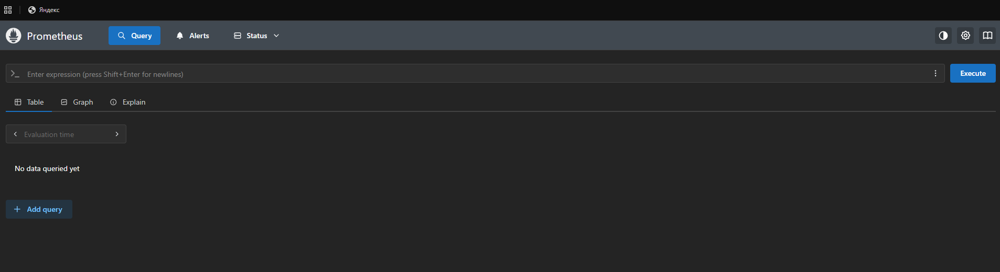
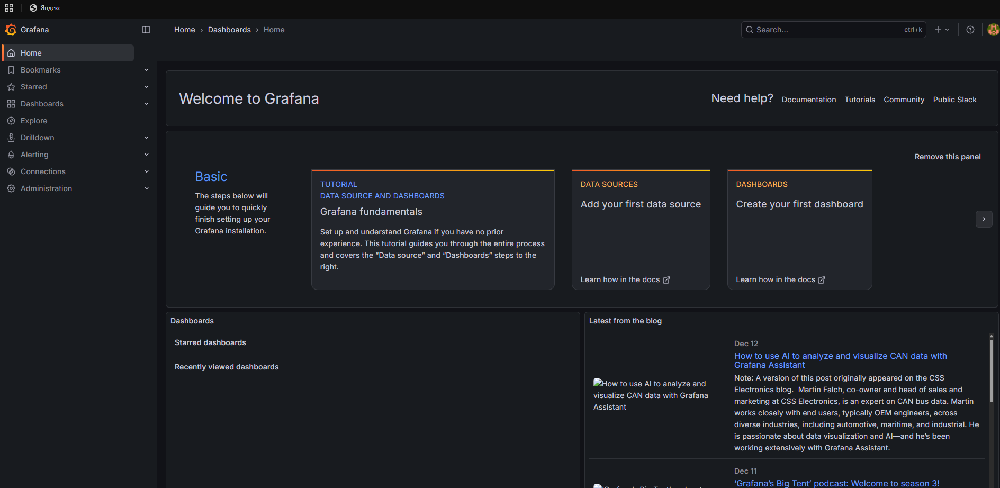
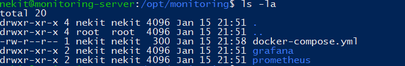

# DevOps Monitoring Stack Project

Infrastructure as Code проект для развертывания стека мониторинга Prometheus + Grafana.

## Архитектура
- Prometheus (порт 9090) - сбор метрик
- Grafana (порт 3000) - визуализация
- Node Exporter - системные метрики

## Технологии
- Terraform - инфраструктура
- Ansible - конфигурация
- Docker - контейнеризация
- GitHub Actions - CI/CD

## Как развернуть
1. Замените IP в ansible/inventory.ini
2. Запустите: ansible-playbook -i inventory.ini playbook.yml
3. Откройте:
   - Grafana: http://IP:3000 (admin/admin)
   - Prometheus: http://IP:9090

## 📸 Скриншоты работы

### Prometheus

### Grafana  

### Docker контейнеры

### Структура проекта

